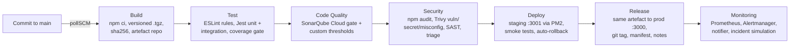

# ProofSprint: DevOps pipeline with Jenkins (SIT223/SIT753 Task 7.3HD)

**Aaryan Dandona (s224842524)**

ProofSprint is an AI-assisted customer-discovery app for non-technical student founders. It was pitched to the InnovAIte capstone company in Task 7.2D. A founder describes an idea, and ProofSprint does the following:

- maps the riskiest assumptions behind it
- writes a Mom-Test interview script and checks it for bias
- collects chat interviews from real customers through a single share link
- turns the answers into quote-backed insights, an evidence score and a pivot / persevere / keep-testing recommendation

This repository contains the MVP and a **seven-stage Jenkins pipeline**: **Build → Test → Code Quality → Security → Deploy → Release → Monitoring**.



## The application

| Area | What it does | Code |
|---|---|---|
| Auth | Register and log in with bcrypt password hashes and JWT sessions; login is rate-limited | `src/routes/auth.js` |
| Validation sprints | CRUD for sprints. Creating a sprint maps the assumptions and builds a bias-checked script | `src/routes/sprints.js`, `src/services/` |
| Participant interviews | Public, token-protected chat interview with consent and an automatic follow-up when an answer is too short | `src/routes/interviews.js`, `src/services/interviewEngine.js` |
| Insights | Links each answer to an assumption, labels the evidence strong, moderate, weak or contradicted (at least two quotes), and gives a score and recommendation | `src/services/insights.js` |
| Ops endpoints | `/health`, `/ready`, `/version`, Prometheus `/metrics`, and key-protected incident simulation at `/api/admin/chaos` | `src/routes/health.js`, `src/middleware/chaos.js` |

**Stack:** Node.js, Express 5, Helmet, express-rate-limit, JWT, bcryptjs, Pino JSON logs, prom-client, Jest and Supertest, ESLint with eslint-plugin-security.

The app has 53 automated tests with about 98% line coverage.

## Pipeline stages

| Stage | Tools | Gate |
|---|---|---|
| **Build** | `npm ci`, `ci/scripts/package.js`, `tar`, SHA-256, local artefact repository | Versioned artefact `proofsprint-1.0.<build>.tgz` with `build-info.json`, fingerprinted in Jenkins |
| **Test** | ESLint (custom complexity and size rules), Jest unit and integration tests, Supertest, JUnit and Coverage plugins | Any lint error, failing test, or line coverage under 85% fails the build |
| **Code Quality** | SonarQube Cloud (SonarScanner CLI) plus the ESLint report imported as external issues | The SonarCloud quality gate (the scanner waits for it), plus custom thresholds on coverage, duplication, A ratings, smells and complexity (`ci/scripts/sonar.js`) |
| **Security** | `npm audit`, Trivy (dependency CVEs, secrets and misconfiguration in the source tree, plus a scan of the shipped artefact), eslint-plugin-security | Any untriaged HIGH or CRITICAL finding in shipped code, or any secret, fails the build. Decisions and reasons live in `security/triage.json` |
| **Deploy** | PM2 staging server on port 3001, `deploy/staging.env`, `ci/scripts/smoke.js` | Health, version and an 11-step API smoke test. A failure rolls back to the previous release automatically |
| **Release** | The same checksum-verified artefact goes to production on port 3000 with `deploy/production.env`, plus a Git tag `v1.0.<build>`, release manifest and release notes | Production smoke tests, with automatic rollback |
| **Monitoring** | Prometheus (6 alert rules), Alertmanager, the alert-notifier webhook and ntfy.sh push, all provisioned from `monitoring/` | Targets must be up and rules loaded. The incident simulation must see the alert fire, notify the team and resolve |

The first run downloads every tool (SonarScanner, Trivy, PM2, Prometheus, Alertmanager) into `%JENKINS_HOME%\proofsprint-ops\tools`. No installers or admin rights are needed.

## Set up the pipeline

The Jenkins agent is Windows. It needs Git, Node.js 20 or later, and Jenkins with the Pipeline, Git, Credentials Binding, JUnit, Coverage and Timestamper plugins.

1. Clone the repository:

   ```
   git clone https://github.com/automacioai-code/SIT223-7.3HD-ProofSprint.git
   ```

2. Add a **Secret text** credential with the ID `SONAR_TOKEN`: a SonarCloud token for the `automacioai-code` organisation.
3. Create a **Pipeline** job:
   - Definition: *Pipeline script from SCM*
   - SCM: Git, with the repository URL above
   - Branch: `*/main`
   - Script path: `Jenkinsfile`
4. Click **Build with Parameters**. `SIMULATE_INCIDENT` and `SIMULATE_BAD_DEPLOY` switch the demos on and off.

## Running environments

| Service | URL |
|---|---|
| Production | http://127.0.0.1:3000 |
| Staging | http://127.0.0.1:3001 |
| Prometheus (alerts, targets) | http://127.0.0.1:9090/alerts |
| Alertmanager | http://127.0.0.1:9093 |
| Team alert feed | http://127.0.0.1:9095 and https://ntfy.sh/proofsprint-s224842524-alerts |
| SonarCloud | https://sonarcloud.io/project/overview?id=automacioai-code_SIT223-7.3HD-ProofSprint |

## Run locally

```
npm ci
npm test            # unit + integration tests
npm run lint
npm start           # http://localhost:3000
```
